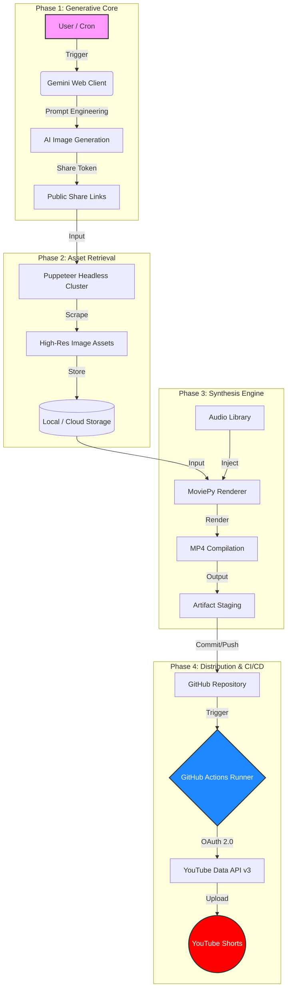
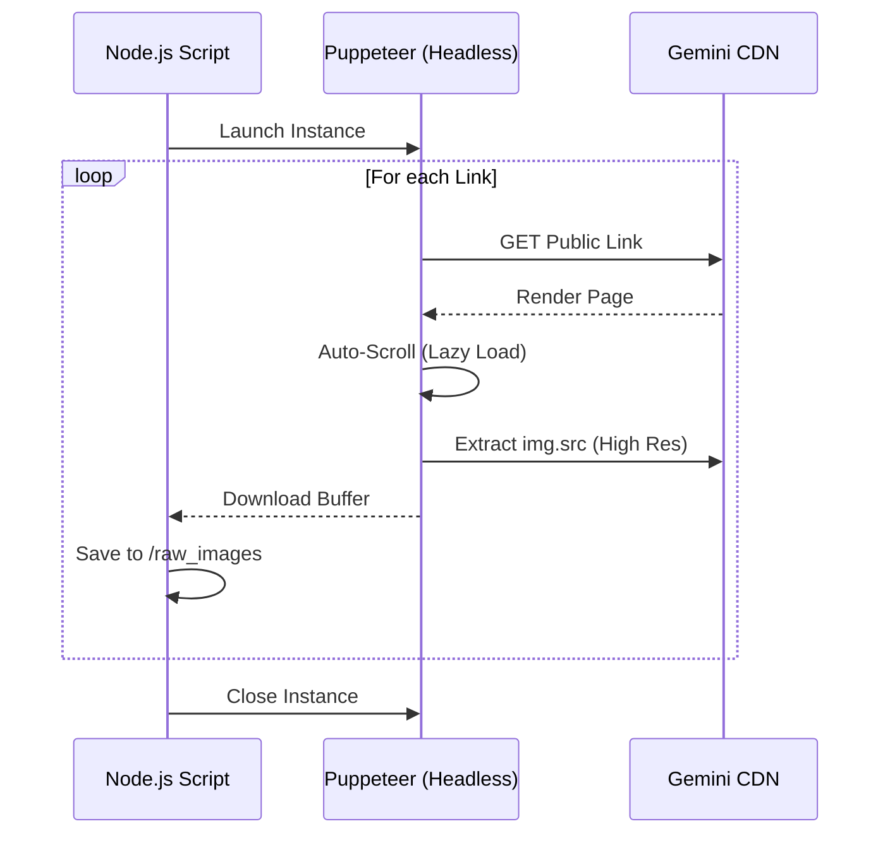

# 🛑 VibeForge Pipeline [SHUTDOWN]

> **📅 Project Status: Archived (Feb 2026)**
> This project has been successfully concluded. The automation pipeline verified the scalability of AI content generation across 7 channels, generating **162k+ views**. All workflows have been disabled to prevent content repetition.

# ⚡ VibeForge Pipeline

### Enterprise-Grade Content Orchestration & Automation Engine

[](https://github.com/your-username/vibeforge-pipeline)
[](https://github.com/features/actions)
[](https://python.org)
[](https://deepmind.google/technologies/gemini/)

> **⚖️ Compliance & Legal Notice**
> This system leverages headless browser automation and unofficial API usage patterns. It is intended strictly for **research and private testing**. Public deployment or commercial use may violate the Terms of Service of target platforms (YouTube, Google). Proceed with caution.

-----

## 🏗 System Architecture

VibeForge is not just a script; it is an **event-driven micro-pipeline**. It decouples content generation (AI) from distribution (YouTube), bridged by a robust rendering engine.

### High-Level Data Flow



-----

## 🚀 Key Features

| Component | Technology | Description |
| :--- | :--- | :--- |
| **Generative AI** | Gemini Pro | Generates 90+ cinematic vertical images/hour via browser automation loops. |
| **Stealth Scraper** | Puppeteer | Headless node script that handles lazy-loading, pagination, and asset extraction without API costs. |
| **Render Farm** | MoviePy | Python-based video compositor. Handles resizing (1080x1920), audio mixing, and fading. |
| **Orchestrator** | GitHub Actions | Serverless cron jobs that handle authentication refresh and scheduled uploading. |
| **Telemetry** | Next.js / Vercel | Real-time dashboard tracking view velocity, subscriber delta, and pipeline health. |


-----

## 🏆 Performance Highlights (Lifespan: 2025-2026)

The automation pipeline has successfully scaled across multiple niches, generating significant organic traction without manual intervention.

| Channel | Niche | Total Views | Watch Time (Hrs) | Verdict |
| :--- | :--- | :--- | :--- | :--- | 
| **AI Models** 🌟 | Virtual Influencers | **85,517** | **100.5** | 🚀 Viral |
| **Illusions Matrix** | Abstract Visuals | **28,039** | **24.1** | ✅ Growing |
| **Genz Automation** | Gen Z Trends | **18,327** | **13.1** | 📈 Steady |
| **AI Girls** | Aesthetic Characters | **12,015** | **10.2** | 🟢 Emerging |
| **Brainrot Memes** | Internet Culture | **8,126** | **4.6** | 🔼 Rising |
| **Motivational Quotes** | Inspiration | **7,767** | **3.5** | ⚖️ Stable |
| **Brainrot** | Experimental | **2,203** | **1.2** | 🧪 Test Bed |

> **Total Network Impact:** ~162,000+ Views & 148+ Hours of Watch Time

-----


## 📂 Engineering Directory Structure

```text
VibeForge-Pipeline/
├── .github/workflows/           # [ARCHIVED] CI/CD Orchestration
├── assets/                      # Binary Storage (Audio/Images)
├── config/                      # Global Configuration
├── docs/                        # Dashboard & Documentation
├── src/
│   ├── automations/             # Content Generation Modules
│   │   ├── ai_models/           # Virtual Influencer Logic
│   │   ├── brainrot/            # Meme Generators
│   │   ├── genz/                # Trend Trackers
│   │   └── youtube_shared/      # Common Upload Utilities
│   ├── core/                    # Shared Infrastructure
│   │   ├── video_engine/        # MoviePy Rendering Engine
│   │   └── backend/             # Analytics Microservice
│   └── scraper/                 # Headless Browser Logic (Puppeteer)
├── requirements.txt             # Python Dependencies
└── package.json                 # Node.js Dependencies
```

-----

## 🛠️ Installation & Setup

### 1\. Environment Configuration

The pipeline requires specific credentials to operate. Store these in your `.env` file locally or **GitHub Secrets** for production.

```bash
# Security Credentials
CLIENT_ID="<google_client_id>"
CLIENT_SECRET="<google_client_secret>"
REFRESH_TOKEN="<long_lived_refresh_token>"

# Pipeline Config
MAX_DAILY_UPLOADS=5
RENDER_FPS=30
```

### 2\. Dependency Injection

**Python (Renderer & Backend):**

```bash
python -m venv .venv
source .venv/bin/activate
pip install -r requirements.txt
# Key libs: moviepy, google-auth, pandas
```


**Node.js (Scraper & Dashboard):**

```bash
npm install
# Key libs: puppeteer, fs-extra
```

-----

## ⚙️ Operational Workflow

### Phase 1: Bulk Generation (Gemini)

> **Strategy:** We bypass API costs by utilizing the web interface via console injection.

1.  Navigate to `src/scraper/generators/script.js`.
2.  Copy the script.
3.  Open Google Gemini (Personal Account).
4.  Paste into Console.
5.  **Result:** An array of shareable public links.

### Phase 2: Asset Extraction (Puppeteer)

> **Strategy:** The downloader mimics human behavior to avoid bot detection.



### Phase 3: Composition & Upload

The `production_upload.yml` workflow triggers the Python renderer.

  * **Input:** Random image from `assets/raw_images` + Random track from `assets/audio_stems`.
  * **Process:**
    1.  Image resized to `1080x1920`.
    2.  Ken Burns effect (pan/zoom) applied (optional).
    3.  Audio normalized to -14 LUFS.
    4.  Video encoded to H.264 `.mp4`.
  * **Output:** Uploaded to YouTube via API v3 with metadata (Tags, Title, Description).

-----

## 📊 Telemetry & Dashboard

The dashboard provides a "Single Pane of Glass" view of the channel network.

**Data Schema (`dashboard_data.json`):**

```json
{
  "updated_at": "2025-11-26T20:00:00Z",
  "channels": [
    {
      "id": "UC_xyz123",
      "name": "Daily Motivation",
      "metrics": {
        "views_7d": 15400,
        "subs_net": 45,
        "last_upload_status": "SUCCESS"
      }
    }
  ]
}
```

-----

## 🛑 Troubleshooting / FAQ

\<details\>
\<summary\>\<strong\>Error: \<code\>QuotaExceeded\</code\> (YouTube API)\</strong\>\</summary\>

> **Diagnosis:** You have hit the daily write limit (usually 1,600 units for free tier).
> **Resolution:**
>
> 1.  Implement a rotation logic to switch API keys.
> 2.  Reduce `MAX_DAILY_UPLOADS` in config.
> 3.  Request a quota extension from Google Cloud Console.

\</details\>

\<details\>
\<summary\>\<strong\>Error: Puppeteer \<code\>SelectorNotFound\</code\>\</strong\>\</summary\>

> **Diagnosis:** Gemini changed their DOM structure (CSS classes).
> **Resolution:** Inspect the Gemini page, find the new class name for the image container, and update `gemini.js` constants.

\</details\>

-----

## 🗺️ Roadmap

  - [ ] **v2.0:** Dockerize the entire rendering engine.
  - [ ] **v2.1:** Implement Whisper AI for auto-caption generation.
  - [ ] **v3.0:** Migrate from local JSON to PostgreSQL for analytics.

-----

## 🤝 Contribution

We follow the **GitFlow** workflow.

1.  Fork the Project.
2.  Create your Feature Branch (`git checkout -b feature/AmazingFeature`).
3.  Commit your Changes.
4.  Open a Pull Request.

-----

**License:** MIT  
**Maintained by:** Sambhav Gautam
